# YOGA DAY

> Different User can login/signUp to YOGA-DAY app and enrolle in multiple yoga classes.

## 🚀 Demo

Watch our demo video on YouTube: [Demo Video](https://youtu.be/RIPUA3hFfbA)

## 🛠️ Backend Development

Use Nodejs and ExpressJs

### 🚀 Backend Deployment

The backend is deployed on [Render](https://render.com/). You can access the live deployment [here](https://yoga-day.onrender.com).

## 🌐 Frontend Development

Use ReactJs

### 🚀 Frontend Deployment

The frontend is deployed on [Netlify](https://www.netlify.com/). You can access the live deployment [here](https://6581c9a1646ba23587051d8c--lighthearted-pothos-539ef9.netlify.app/).

## 💾 Database 

Use MongoDB

### Entity-Relationship (ER) Diagram and Table Schema
  - <u> **Assumption are taken to run this application smoothly.** <u>
  
    * **token is note able to store in the cookies.**
    * to run application correctly
        * Go backend/backend/middlewares/tokenAuth.js and uncomment the token contain line
        * Change the token value from local storage.
    * payment api only change the state of the paymentStatus in Batch table.
    * Age restriction only apply to the registering to new yoga classes.
    * Below 18 and above 65 can also register to application.
    * Error handeling not done propery on the Frontend.

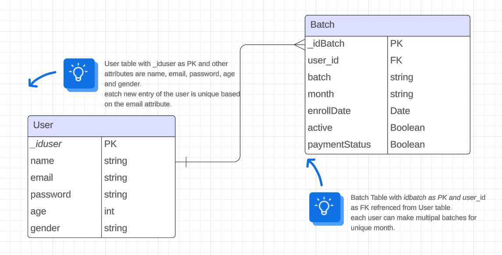

- <u> **Approch behind this ER diagram** <u>
* Any user can register/login to the application<u>
* User can enroller to yoga classes for current month and feature months also.
* User can pay fees before starting to the yoga classes for current month.
* User cannot register for different batched for same month.

**User Schema**
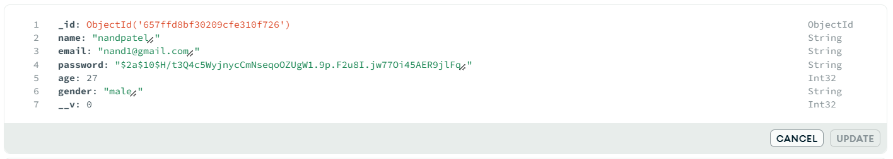
**Batch Schema**
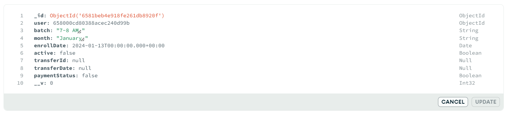

## 🌄 Images

### API Testing

**SignUp API testing**
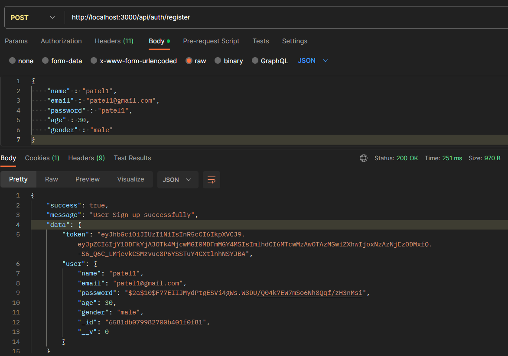
**login API testing**
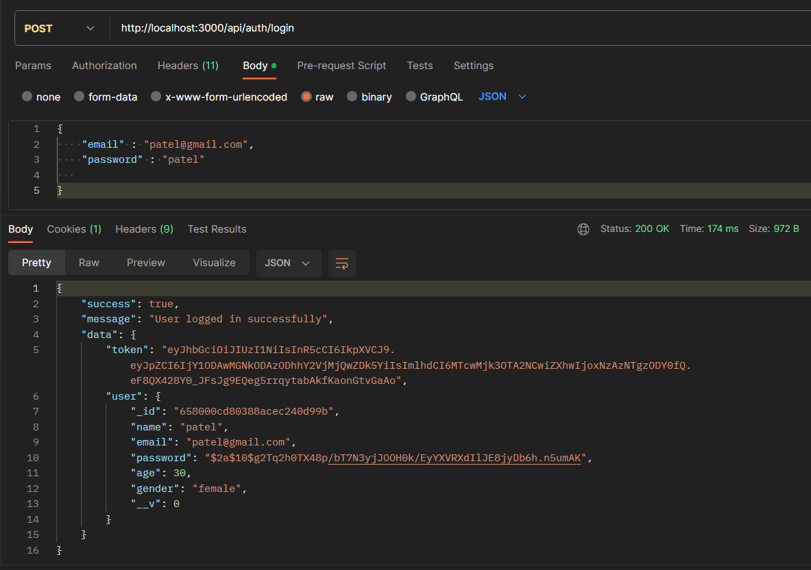
**logout API testing**
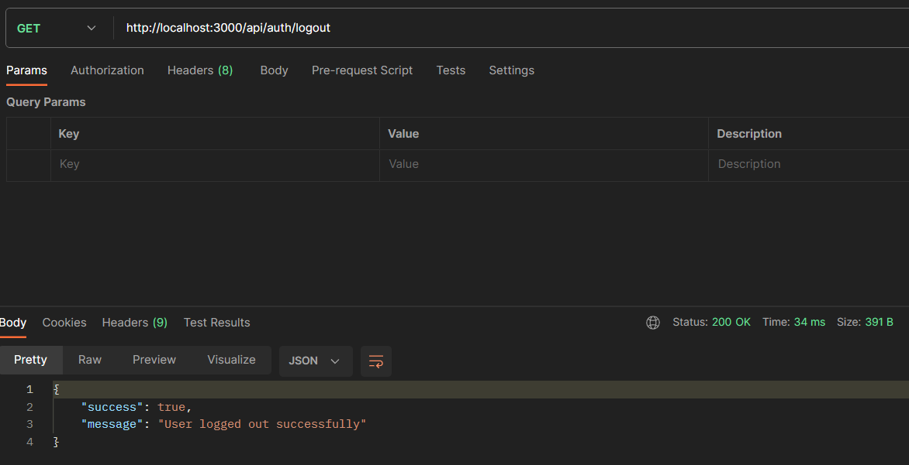
**fetch user details API testing**
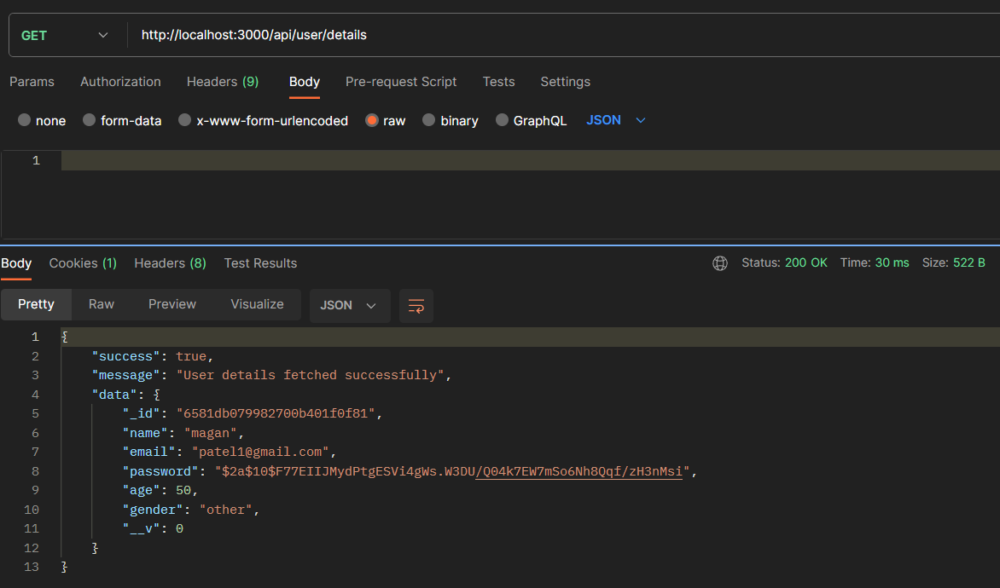
**user details update API testing**
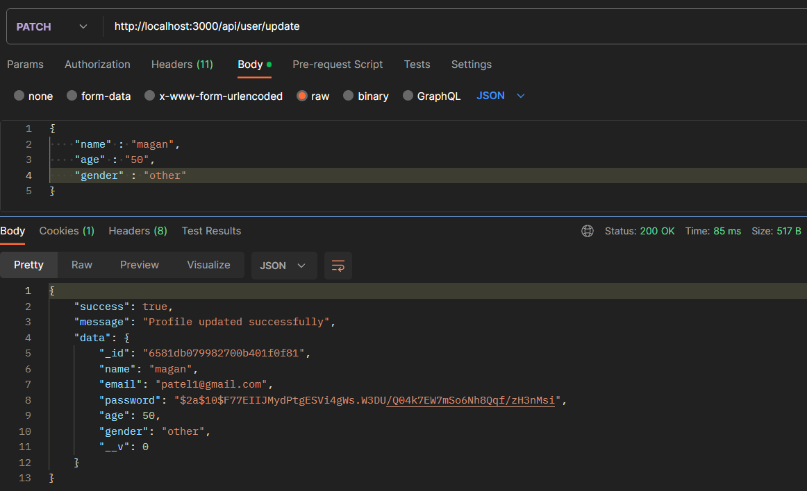
**new batch register API testing**
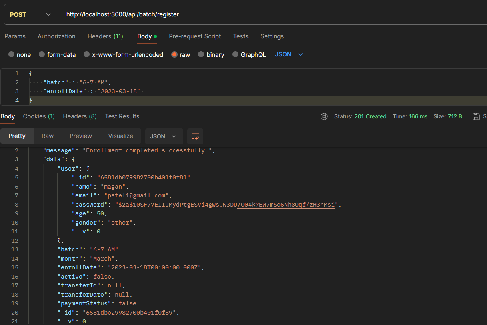
**fetch all batch of user API testing**
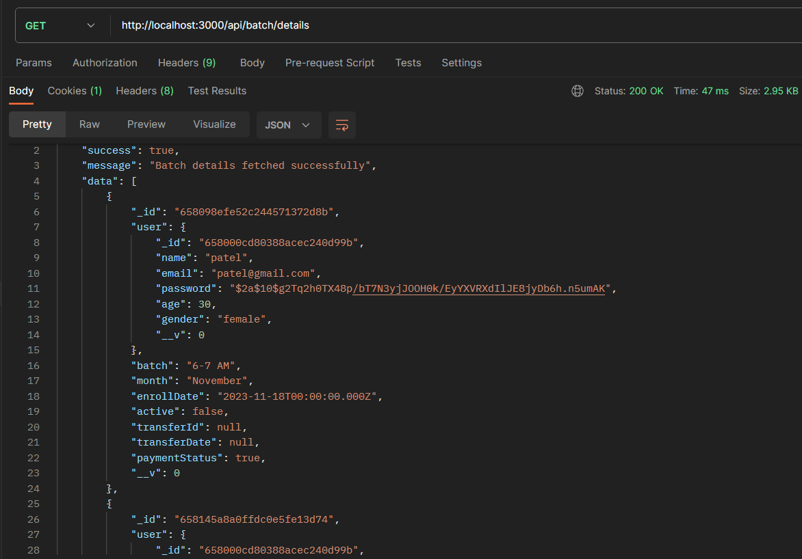
**payment API testing**
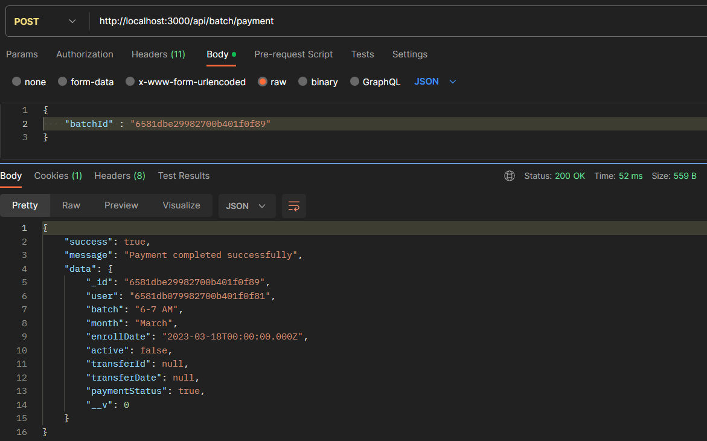

### Website Images

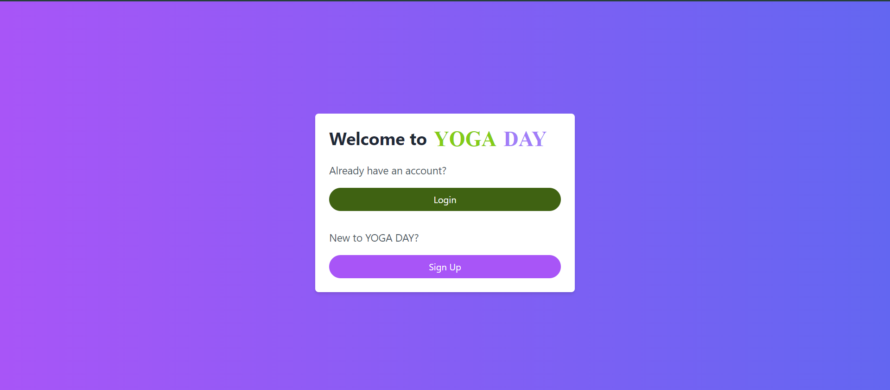
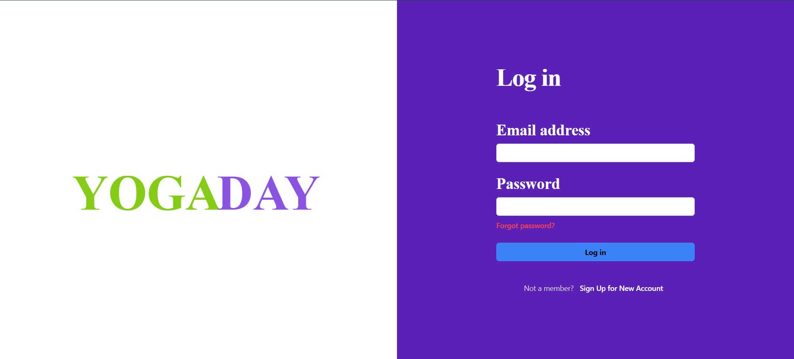

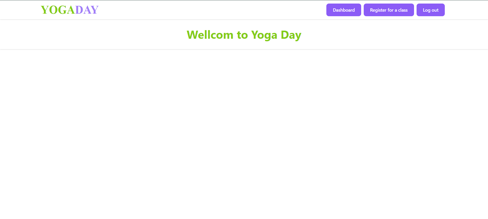
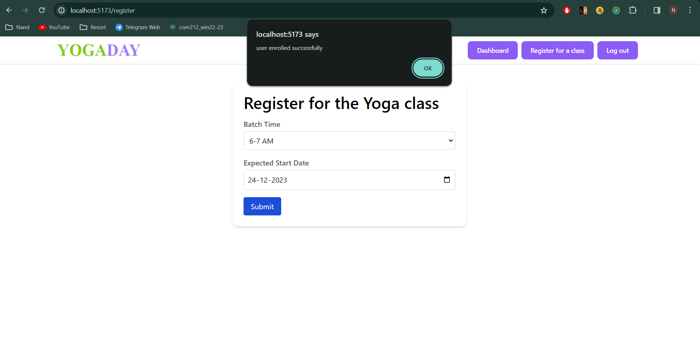
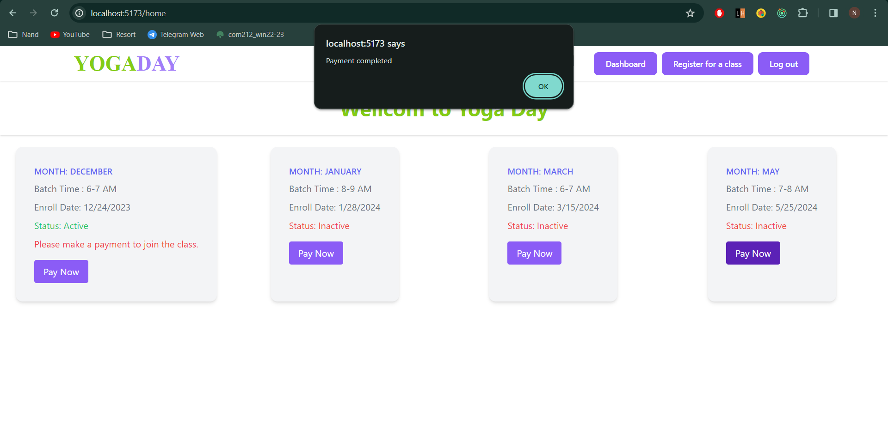
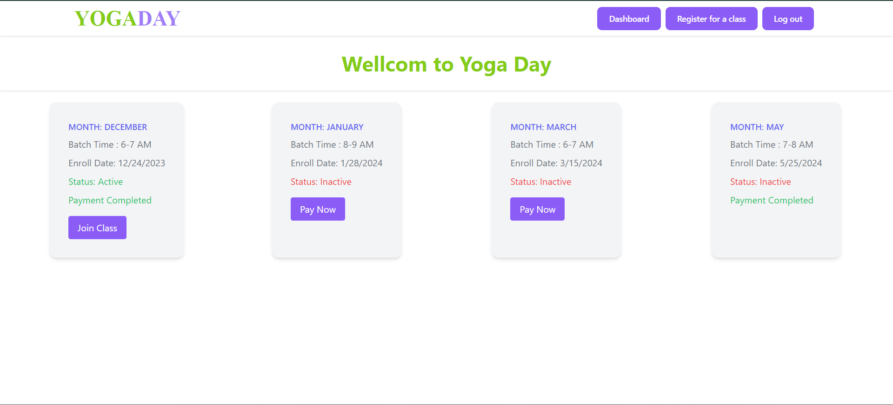
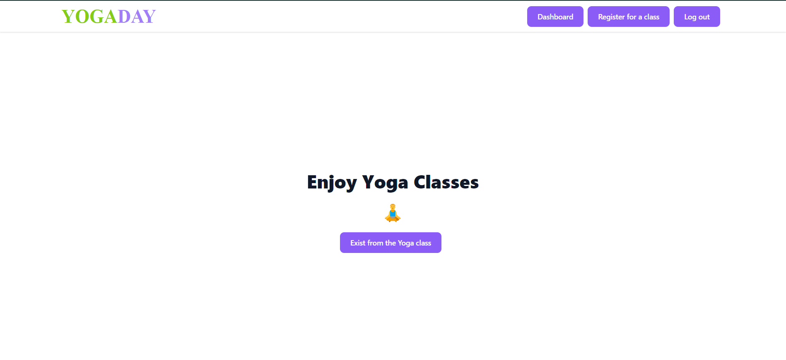
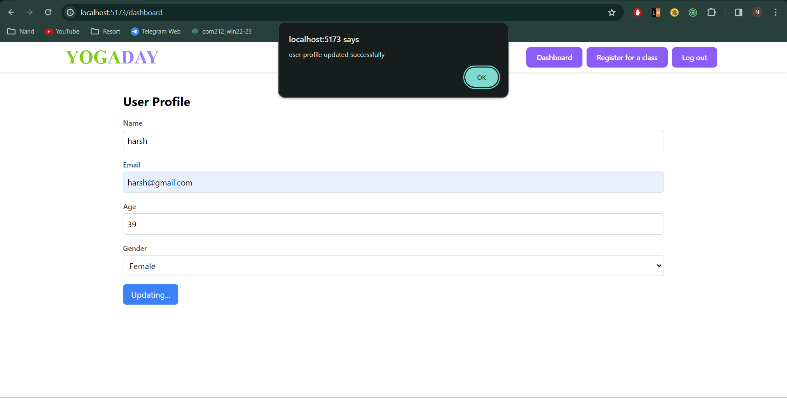


### 🛠️ Clone and Build Locally

```bash
# Clone the repository
git clone https://github.com/NandPatel1292/yoga-app

# Navigate to the backend directory
cd backend

# Install dependencies
npm install

# Create a .env file and add the following fields:
# PORT
# NODE_ENV
# MONGO_URI
# JWT_SECRET
# JWT_EXPIRE

# Run the development server
npm run dev

# Navigate to the frontend directory
cd frontend

# Install dependencies
npm install

# Run the development server
npm run dev
---
```

**Feel free to fork, star, or contribute to this project!**
